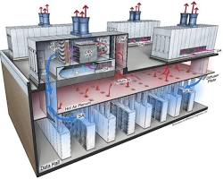
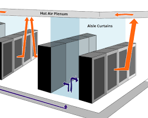

# Student Info

Name: 
Course: 
Section: 

---

# Personal Background

I have worked professionally in dev ops for a couple of years so Any Questions Related to it i'll answer from my expertise and compare it with the AI Answer 

# Assignment 1

Note The Fact Since Time has passed there has been an improvement in the Gemini Model Which may cause some differences in response from other submissions

## Question 1 

DataCenter Images      

### My Answer

my Definition of a Datacenter is that it is a Physical place where computing power and resources are stored and shared between entities 

### The Gemini Answer

The Prompt:
" Show me 5 Images of Datacenters, Add captions for each image, showing the original URL of the image and a description of the figure. "

Generated Images :

Link: https://www.google.com/url?sa=E&source=gmail&q=https://www.istockphoto.com/photos/data-center-servers

Link: https://www.google.com/search?q=https://www.shutterstock.com/image-photo/it-engineer-rack-server-room-260nw-1052601726.jpg

Link: https://www.google.com/search?q=https://www.gettyimages.com/detail/photo/data-center-cooling-system-royalty-free-image/171358990

Link: https://www.google.com/search?q=https://www.dreamstime.com/data-center-security-system-image172667107

Link: https://www.google.com/search?q=https://www.datacenterknowledge.com/energy/how-microsoft-aims-make-its-data-centers-carbon-negative

## Question 2

Cloud And it's Ties to Datacenters

### My Answer

The Terms Cloud and Datacenters are closely Tied Together Since Datacenters are The Physical Place Where the Nebulous Thing Called the Cloud Exists, So the Cloud is a Resource in A Datacenter or Multiple Datacenters

### ChatGPT Answer

Keywords: Network , AWS , Azure , Subscription Model , Risks , Cyber Attacks

Prompt : " write a meaningful sentences that link the two keywords cloud and datacenter. the sentence must contain the words cloud, datacenter, and **Keyword** "

#### Subscription Model : 

Response : " Many businesses are shifting from traditional datacenters to the cloud, leveraging a **subscription model** to reduce upfront infrastructure costs and scale resources dynamically. "

#### AWS : 

Response : " **AWS** provides cloud computing services that enable businesses to reduce reliance on traditional datacenters by offering scalable and on-demand infrastructure solutions. "

#### Network :

Response : " A cloud service relies on a robust **network** infrastructure to efficiently connect users to the datacenter, where computing resources and storage are managed. "

#### Risks : 

Response : " Storing data in the cloud reduces the need for a physical datacenter, but it also introduces security and compliance risks that organizations must carefully manage. "

## Question 3 

Why is This an Assignment on Distributed Systems Course

### My Answer 

It is Because AI Apps Such as Gemini,ChatGPT and Deepseek Extensivly Use the Cloud and Distributed Systems as they Require an Incredible Ammount of Computing Power through GPUs or The Proccessing Units such as TPUs & NPUs , As Seen By OpenAI Using Azure

### AI Answers

Prompt: 
"
PlainText of The Assignment Within markdown CodeBlocks

why was this assignment a part of the requirements in a course on distributed systems.
"

#### ChatGPT

Using The Reasoning Model Since this Question in My Opinion Requires it 

Reasoning: 
"
The reason this assignment is part of the course requirements is that it helps introduce students to key concepts of distributed systems. These include topics like data centers, cloud computing, monitoring, availability, and resiliency. It also aims to show real-world applications of distributed systems, like how data moves across networks. Additionally, students use AI tools like Gemini and ChatGPT to extract, analyze, and synthesize information, which ties into practical skills for working with distributed systems.

This assignment is a key part of a distributed systems course because it evaluates technical understanding, research, and writing skills. It helps students learn about the practical aspects of distributed systems, such as cloud, data centers, server architecture, and network protocols. By incorporating real-world examples like a Microsoft Datacenter tour, it links academic theory to industry practice. It also encourages critical thinking and the use of AI tools for data analysis, all of which are essential components in learning about distributed systems."

Response : 
" 
This assignment is integrated into a distributed systems course because it bridges theoretical concepts with real-world applications by engaging students in a hands-on exploration of the infrastructure and operational principles that underpin modern distributed computing. Here are some key reasons:

    Real-World Exposure:
    The virtual tour of the Microsoft Datacenter allows students to see firsthand how a distributed system is structured and managed. By navigating through different rooms (lobby, operations, server, and network), students gain insight into the physical and logical components of a large-scale system, such as how data centers support cloud services.

    Understanding Core Concepts:
    The assignment emphasizes essential distributed systems concepts like availability, resiliency, and network operations. For instance, by investigating why the server room is described as the “heart” of the datacenter or exploring the relationship between Points of Presence (POPs) and services like Xbox Live, students learn how these principles ensure that distributed systems remain robust, efficient, and scalable.

    Integration of Modern Tools and Practices:
    By requiring the use of AI models (Gemini and ChatGPT) to extract, analyze, and synthesize information, the assignment mirrors current industry practices. This approach not only reinforces theoretical knowledge but also enhances students’ ability to leverage modern technologies for problem-solving and data interpretation in distributed systems.

    Linking Theory to Practice:
    The tasks involve critical analysis of multimedia resources (images and videos) and require students to articulate their findings through well-structured technical descriptions and summaries. This process of connecting visual and textual data with theoretical constructs from textbooks reinforces a deep understanding of how distributed systems operate in dynamic environments.

Overall, the assignment is designed to ensure that students can apply abstract concepts of distributed systems to practical, real-world scenarios, thereby preparing them for challenges they may encounter in industry roles related to cloud computing and data center management. "

#### Gemini

Response:
" 
This assignment is part of a distributed systems course for several key reasons, all centered around understanding the complexities and challenges of modern, large-scale computing infrastructure. Let's break down how each section contributes:

    Focus on Datacenters and Cloud Computing: Datacenters are the physical embodiment of distributed systems. They are massive, interconnected networks of servers working together to provide services. Cloud computing, heavily reliant on datacenters, is a prime example of a distributed system. The assignment's focus on these topics directly aligns with the core concepts of distributed systems.  Students are learning about the physical infrastructure that underpins distributed applications.

    Understanding Distributed System Concepts: The tasks within the assignment implicitly cover several crucial distributed systems concepts:
        Scalability: Datacenters are designed for massive scalability, handling vast amounts of data and user requests. The assignment touches upon this by exploring the size and components of a datacenter.
        Availability and Resiliency: These are critical in distributed systems. The assignment explicitly asks students to investigate these concepts within the context of a datacenter. Redundancy, failover mechanisms, and disaster recovery are all related to these ideas and are vital in distributed systems.
        Networking: The "How data travels" video and the network room visit emphasize the importance of networking in distributed systems. Understanding how data moves between different parts of a distributed system is fundamental.
        Resource Management: While not explicitly stated, the discussion of servers, their specifications, and the overall infrastructure hints at the complex resource management required in distributed systems. Scheduling, load balancing, and resource allocation are essential in this context.
        Data Consistency: Although not directly addressed, the emphasis on accuracy and integrity in the assignment foreshadows the challenges of maintaining data consistency across a distributed system.

    Practical Application and Exploration: The virtual tour of the Microsoft Datacenter provides a real-world context for the theoretical concepts.  Students aren't just reading about distributed systems; they're exploring a concrete example of one.  This experiential learning is invaluable.

    Use of AI Tools: The assignment encourages the use of ChatGPT and Gemini.  This is likely intentional to familiarize students with tools that are increasingly used in distributed systems development and management.  These tools can assist with tasks like code generation, documentation, and even system monitoring and analysis.

    Emphasis on Individual Work and Academic Integrity: The strict policy regarding individual work and plagiarism is crucial.  Distributed systems projects often involve collaborative work, and it's essential for students to develop their own understanding and avoid plagiarism.  This policy reinforces the importance of original thought and ethical practices.

In summary, this assignment is designed to immerse students in the world of distributed systems by exploring the physical and conceptual aspects of datacenters and cloud computing. It encourages them to learn key concepts, apply them in a practical setting, and utilize relevant AI tools, all while maintaining academic integrity. "

