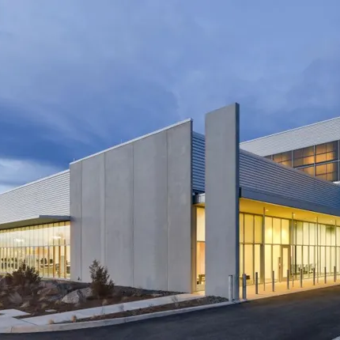
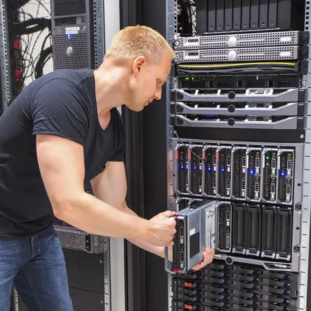

---

# Personal Background

I have worked professionally in DevOps for a couple of years so Any Questions Related to it i'll answer from my expertise and Then Get the AI Answer 

# Assignment 1

Note: The Fact Since Time has passed so there has been an improvement in the Gemini Model Which may cause some differences in response from other submissions

## Question 1 

DataCenter Images      

### My Answer

my Definition of a Datacenter is that it is a Physical place where computing power and resources are stored and shared between entities 

### The Gemini Answer

The Prompt:
" Show me 5 Images of Datacenters, Add captions for each image, showing the original URL of the image and a description of the figure. "

Generated Images :

Figure 1 Description: A large data center with rows of servers, indicating the scale and complexity of modern computing infrastructure.

[Link](https://www.google.com/url?sa=E&source=gmail&q=https://www.istockphoto.com/photos/data-center-servers)

Figure 2 Description: A technician working on a server in a data center, highlighting the human element and the importance of maintenance and upkeep.

[Link](https://www.google.com/search?q=https://www.shutterstock.com/image-photo/it-engineer-rack-server-room-260nw-1052601726.jpg)

Figure 3 Description: A close-up of cooling systems in a data center, emphasizing the importance of thermal management in maintaining the performance and reliability of servers.

[Link](https://www.google.com/search?q=https://www.gettyimages.com/detail/photo/data-center-cooling-system-royalty-free-image/171358990)

Figure 4 Description: A data center with security measures in place, such as surveillance cameras and access control systems, highlighting the importance of protecting sensitive data.

[Link](https://www.google.com/search?q=https://www.dreamstime.com/data-center-security-system-image172667107)

Figure 5 Description: A data center with a focus on energy efficiency, such as renewable energy sources and innovative cooling solutions, emphasizing the importance of sustainability in modern data centers.

[Link](https://www.google.com/search?q=https://www.datacenterknowledge.com/energy/how-microsoft-aims-make-its-data-centers-carbon-negative)

However DataCenter 4 Isn't an image of a Datacenter at All it seems to have gotten it from an Article Speaking about a Datacenter However I'll Include an image of the outside of a Datacenter Just for Refrence

[Link](https://datacenters.atmeta.com/wp-content/uploads/2023/03/PRN-1.jpg?resize=1536,768)

## Question 2

Cloud And it's Ties to Datacenters

### My Answer

The Terms Cloud and Datacenters are closely Tied Together Since Datacenters are The Physical Place Where the Nebulous Thing Called the Cloud Exists, So the Cloud is a Resource in A Datacenter or Multiple Datacenters

### ChatGPT Answer

Keywords: Network , AWS ,  , Subscription Model , Risks

Prompt : " write a meaningful sentences that link the two keywords cloud and datacenter. the sentence must contain the words cloud, datacenter, and **Keyword** "

#### Subscription Model : 

Response : " Many businesses are shifting from traditional datacenters to the cloud, leveraging a **subscription model** to reduce upfront infrastructure costs and scale resources dynamically. "

#### AWS : 

Response : " **AWS** provides cloud computing services that enable businesses to reduce reliance on traditional datacenters by offering scalable and on-demand infrastructure solutions. "

#### Network :

Response : " A cloud service relies on a robust **network** infrastructure to efficiently connect users to the datacenter, where computing resources and storage are managed. "

#### Risks : 

Response : " Storing data in the cloud reduces the need for a physical datacenter, but it also introduces security and compliance **risks** that organizations must carefully manage. "

## Question 3 

Why is This an Assignment on Distributed Systems Course

### My Answer 

It is Because AI Apps Such as Gemini,ChatGPT and Deepseek Extensivly Use the Cloud and Distributed Systems as they Require an Incredible Ammount of Computing Power through GPUs or The Proccessing Units such as TPUs & NPUs , As Seen By OpenAI Using Azure

### AI Answers

Prompt: 
"
*PlainText of The Assignment Within markdown CodeBlocks*

why was this assignment a part of the requirements in a course on distributed systems.
"

#### ChatGPT

Using The Reasoning Model Since this Question in My Opinion Requires it 

Reasoning: 
"
The reason this assignment is part of the course requirements is that it helps introduce students to key concepts of distributed systems. These include topics like data centers, cloud computing, monitoring, availability, and resiliency. It also aims to show real-world applications of distributed systems, like how data moves across networks. Additionally, students use AI tools like Gemini and ChatGPT to extract, analyze, and synthesize information, which ties into practical skills for working with distributed systems.

This assignment is a key part of a distributed systems course because it evaluates technical understanding, research, and writing skills. It helps students learn about the practical aspects of distributed systems, such as cloud, data centers, server architecture, and network protocols. By incorporating real-world examples like a Microsoft Datacenter tour, it links academic theory to industry practice. It also encourages critical thinking and the use of AI tools for data analysis, all of which are essential components in learning about distributed systems."

##### Summarized Response : 

**Purpose**: This assignment bridges theoretical concepts with real-world applications in distributed systems. It provides hands-on experience with infrastructure and operational principles.  

- **Real-World Exposure**:  
  - A virtual tour of the Microsoft Datacenter helps students understand distributed system structure and management.  
  - Exploring different rooms (lobby, operations, server, and network) provides insights into physical and logical components supporting cloud services.  

- **Understanding Core Concepts**:  
  - Focuses on key distributed systems principles like availability, resiliency, and network operations.  
  - Examines the server room as the “heart” of the datacenter and the function of Points of Presence (POPs) in services like Xbox Live.  

- **Integration of Modern Tools and Practices**:  
  - Requires using AI models (Gemini and ChatGPT) for data extraction, analysis, and synthesis.  
  - Encourages leveraging modern technologies for problem-solving in distributed systems.  

- **Linking Theory to Practice**:  
  - Involves critical analysis of multimedia resources (images, videos).  
  - Students articulate findings through structured technical descriptions, reinforcing theoretical knowledge with practical applications.  

**Conclusion**: This assignment ensures students can apply abstract distributed systems concepts to real-world scenarios, preparing them for industry roles in cloud computing and data center management.  

#### Gemini

#### Summarized Response:

- Understanding Distributed System Concepts: The tasks within the assignment implicitly cover several crucial distributed systems concepts: Such as Scalability, Availability & Resiliency, Networking, Resource Management , and Data Consistency

- Practical Application and Exploration: The virtual tour of the Microsoft Datacenter provides a real-world context for the theoretical concepts.  Students aren't just reading about distributed systems; they're exploring a concrete example of one. 

- Use of AI Tools: The assignment encourages the use of ChatGPT and Gemini.  This is likely  to familiarize students with tools that are increasingly used in distributed systems development and management.

- Emphasis on Individual Work and Academic Integrity: The strict policy regarding individual work and plagiarism is crucial.  Distributed systems projects often involve collaborative work, and it's essential for students to develop their own understanding and avoid plagiarism.  This policy reinforces the importance of original thought and ethical practices.

In summary, this assignment is designed to immerse students in the world of distributed systems by exploring the physical and conceptual aspects of datacenters and cloud computing. It encourages them to learn key concepts, apply them in a practical setting, and utilize relevant AI tools, all while maintaining academic integrity. "

## Question 4

### What is the Cloud

"a Globally interconnected networks of millions of Computers in Datacenters around the world That Work Together to Store & manage Data , Run Application , And Delevir Content And Services"

### availability & resiliency

First Prompt: " Why is it that in microsoft's datacenter tour and in my Distributed System Course Textbook i'm Hearing the Word "availability" & "resiliency" "

#### Summarized Response :

- **Availability**  
  - *In Microsoft's Data Centers:*  
    - Ensures cloud services (e.g., Azure, Microsoft 365) remain accessible with minimal downtime.  
    - Achieved through redundancy, failover mechanisms, and load balancing.  
    - Measured using SLAs (e.g., "99.99% uptime").  
  - *In Distributed Systems:*  
    - Defined in the CAP theorem as the system’s ability to respond to requests despite failures.  
    - Achieved using replication, partitioning, and consensus algorithms (e.g., Paxos, Raft).  
    - Essential for fault-tolerant databases (e.g., Apache Cassandra, DynamoDB).  

- **Resiliency**  
  - *In Microsoft's Data Centers:*  
    - Infrastructure's ability to recover from failures (e.g., hardware failures, disasters, cyberattacks).  
    - Implemented using backup power, geo-redundant storage (GRS), disaster recovery plans, and automated failover.  
  - *In Distributed Systems:*  
    - System’s ability to function despite node failures, network partitions, or software bugs.  
    - Achieved through retry mechanisms, circuit breakers, self-healing architectures, and eventual consistency.  

- **Why These Terms Appear in Both Contexts**  
  - Cloud data centers are large-scale distributed systems.  
  - Microsoft and other cloud providers use distributed system principles for high availability and resilience.  
  - Understanding these concepts is crucial for data center engineers and cloud-native software developers.  

Second Prompt : " give me examples of the data points that are used to monitor the daily
operation of a cloud datacenter "

#### Summarized Response

- **Infrastructure Monitoring**  
  - CPU & memory usage (%)  
  - Disk I/O (read/write speeds, latency)  
  - Storage throughput & database query response times  
  - Power Usage Effectiveness (**PUE**)  
  - Cooling system efficiency (temperature, airflow)  

- **Network Performance**  
  - Network throughput (Gbps) & latency (ms)  
  - Packet loss (%) & DNS resolution times  
  - Firewall & load balancer health  
  - Failover switch response time  

- **Security & Compliance Monitoring**  
  - Failed login & unauthorized access attempts  
  - DDoS attack detection events  
  - System configuration change logs  
  - Data encryption status  

- **Service & Application Health**  
  - Service uptime percentage (**99.999% SLA**)  
  - Downtime incidents & Mean Time To Recover (**MTTR**)  
  - API response times & error rates (HTTP 500, timeouts)  
  - Application crash reports  

- **User Experience Metrics**  
  - Page load times & streaming buffer rates  
  - Cloud VM instance spin-up times  
  - Customer support ticket trends & AI chatbot effectiveness  

- **Cost & Resource Optimization**  
  - Virtual Machine (VM) instance utilization  
  - Unused/over-provisioned resources  
  - Budget alerts for high-spending services  
  - Energy efficiency reports  

### why a server room is described as the “heart” of the datacenter. 

Prompt: " Explain Briefly why a server room is described as the “heart” of the datacenter. "

#### My Answers 
Because its where people might Say the Magic Happens , as it is where most of the Technical Infrastructure resides 

#### Gemini

Server rooms are the core of data centers.

They are responsible for centralized computing, where most data processing and storage take place.
Server rooms are essential for data center operations; without them, the data center cannot function.
They interconnect with all other data center systems like power, cooling, and security.
Server rooms distribute data and services, similar to a heart pumping blood, making them indispensable.

#### CHATGPT

It plays a vital role in:
- Data processing
- Storage
- Network communications

Just like a heart pumps blood to sustain the body, the server room distributes computing resources to support business operations.

It ensures:

- Reliability: Keeps systems running without interruptions.
- Security: Protects sensitive information.
- Efficiency: Optimizes IT performance for smooth operations.

### Server Blades

#### My Answers 

What is a Blade : 
A Blade is a Special Form Factor of Server Designed to Have as Much Computing Power as Possible in the Smallest Physical Footprint Ie Width and Length by Removing as Much Possibly Shared Components as possible such as power, cooling, and networking

Blade Image : 

#### Gemini Answer

Prompt : " find an image of a server-blade. Add a technical description of
a blade’s specification "

Technical Specification:
A server blade is a compact, modular computing device designed for high density and energy efficiency. It houses essential components like processors, memory, and network interfaces on a single board, which is then inserted into a blade enclosure.This enclosure provides shared resources like power, cooling, and network connectivity, reducing space and infrastructure needs compared to traditional rack servers.  

### POPS & Xbox Live

#### What Are POPs?
- **Definition:** Points of Presence (POPs) are strategically located network access points or data centers.
- **Function:** They route, cache, and deliver content efficiently, ensuring fast, reliable, and low-latency access.

#### Benefits for Xbox Live
1. **Reduced Latency & Improved Performance**
   - **Geographic Proximity:** POPs are deployed globally to reduce the distance data must travel, minimizing lag.
   - **Optimized Routing:** Directs user requests to the nearest or least congested server for smoother gameplay.

2. **Load Balancing & Traffic Management**
   - **High Traffic Handling:** Distributes the load among multiple nodes to prevent any single server from becoming a bottleneck.
   - **Redundancy:** Provides alternative routing paths during network issues to maintain continuous service.

3. **Enhanced Content Delivery**
   - **Caching:** Stores frequently accessed data (game updates, downloadable content) locally for faster retrieval.
   - **Efficient Media Delivery:** Ensures quick and reliable delivery of digital media like game patches and streaming content.

4. **Integration with Cloud Infrastructure**
   - **Microsoft Azure & Beyond:** POPs support Xbox Live as well as other Microsoft services by integrating with a global cloud network, ensuring scalability and security.

#### Conclusion
POPs form the backbone of Xbox Live’s infrastructure by:
- Minimizing latency,
- Efficiently managing heavy traffic loads,
- Delivering digital content swiftly, and
- Enhancing overall service resilience and performance.

